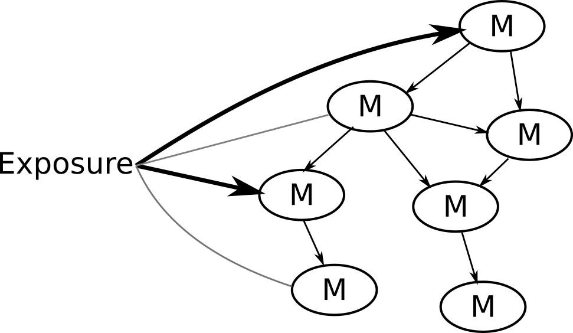
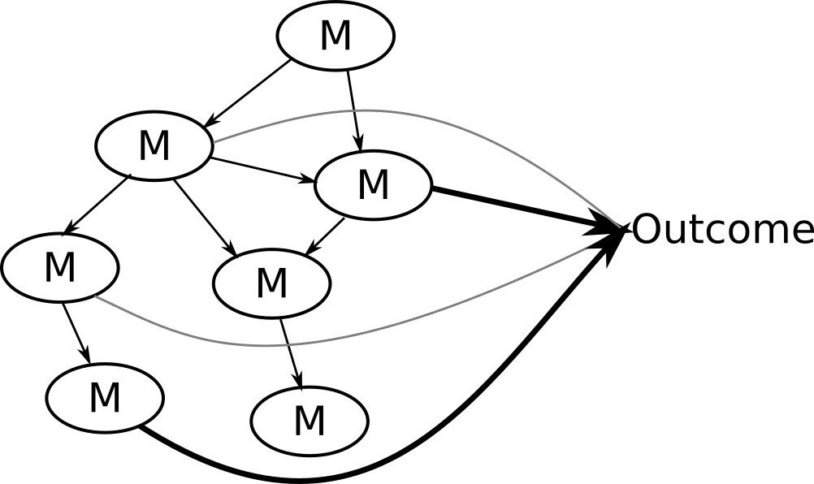
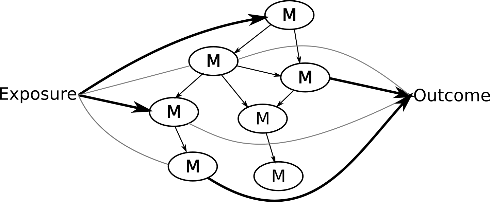
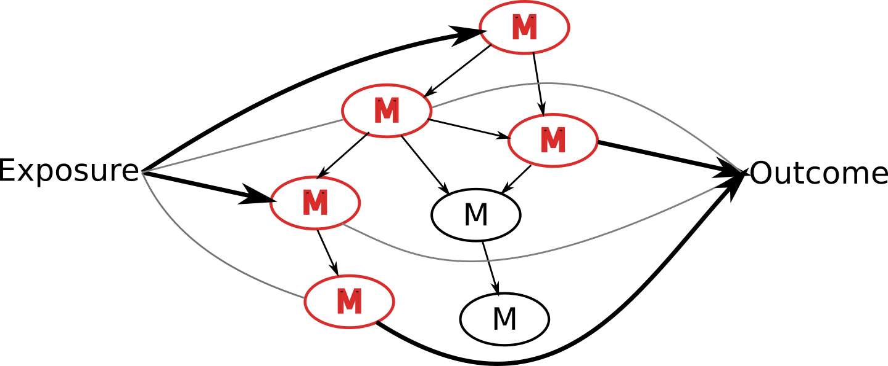

layout: true

<div class="my-footer">
<span>

</span>
</div> 

```{r setup, include=FALSE}
options(htmltools.dir.version = FALSE)

knitr::opts_chunk$set(echo = FALSE)
```

```{r xaringan-themer, include=FALSE}
library(xaringanthemer)
mono_accent(
    base_color = "#105059",
    header_font_google = google_font("Poppins"),
    text_font_google = google_font("Oxygen"),
    text_font_size = "32px"
)
```

---

# Objectives:

- Showcase NetCoupler and its usefulness

- Get feedback on the implementation

---

class: center, middle

# THE PROBLEM

---

## Modern epi studies can generate a lot of metabolic data 

- More -omics type

- High dimensionality

- Complex networks

???

Like metabolomics, fatty acid panels.

Classic epidemiology meaning having an exposure with an output

---

## "Traditional" analysis may use:

Dimensionality reduction:


???

This has the advantage of making things simpler while trying to maximize
variance in the data. Afterward you can do modelling on each principal component.
The disadvantage of this approach is that it loses a lot of information since
the interdependence and connections between variables it not maintained.

---

## "Traditional" analysis may use:

Many regression-type methods:

- Models of outcome with each metabolic variable

```
O1 = M1 + covariates
O1 = M2 + covariates
...
O1 = M7 + covariates
O1 = M8 + covariates
```

???

Some ways you might go about analyzing this data is by running many regression
models, one for each metabolic variable for instance.

This of course has problems since you're simply running a bunch of models and
not taking account of the inherent interdependencies between variables.

---

## "Traditional" analysis may use:

Network analysis

```{r, echo=FALSE, fig.width=7, fig.height=5}
library(pcalg)
set.seed(126)
plot(randDAG(8, 2, "watts"))
```

???

This approach is nice in that you can extract information about the connection
between metabolic variables. But there is no way to incorporate the disease
outcome with this approach and in order to construct the network properly most
methods require you provide a prespecified base network, which you might not know.

---

## So, what if we...

<!-- Problem with these analyses... -->

.pull-left[
- want info about network structure?
- don't know the network structure?
- have an exposure, metabolites, and outcome?
- are interested in causal links?
]

--

.pull-right[

]

---

class: center, middle

# THE SOLUTION

---

## NetCoupler: An algorithm that...

- Finds most likely network structure

- Allows inclusion of exposure and outcome

- Identifies causal links between and within network

.footnote[NetCoupler was developed by Clemens Wittenbecher.]

---

class: middle, center

## Algorithm (steps) used in NetCoupler

---

## 1. DAG skeleton of network is estimated


---

## 2. Initial links formed on exposure-side


---

## 3. Direct effects estimated between exposure and network


---

## 4. Repeat identifying links, find unaffected/ambiguous, delete indirect links



???

If you were interested in linkages with an exposure on the network, you could
stop here.

---

## 5. Initial links formed with outcome-side


---

## 6. Direct effects estimated between network and outcome


---

## 7. Repeat identifying links, delete indirect links, find unaffected/ambiguous



???

You could stop here if you were interested in linkages with the network and an
outcome.

---

## 8. (optional) Combine both estimations into joint model



---

## Find (potentially) causal pathways with graphical model



---

class: center, middle

# OUR WORK

---

## NetCoupler current state

- Series of R scripts

--
  
- Only uses specific methods 

???

- Greats well on Clemens' computer
- Not readily re-usable by others

- PC-algorithm for network
- Cox for modelling
- Not easily extensible to other models

---

## Converting to a usable R package

.center[

]

.footnote[Source: https://github.com/ClemensWittenbecher/NetCoupler]

---

## Converting to a usable R package

.center[

]

???

We've got to improve on the underlying implementation, optimize the code for better
speed and performance, fix up the interface so that other methods can be used
like regression or mixed models, and reduce some software dependencies since
right now it relies on software that is really hard to install and get working.

---

## Goals:

- Submit to CRAN[1]

--

- Create simple interface to use

--

- Create website with documentation

--

- Develop tutorials

.footnote[[1] CRAN distributes R packages.]

---

class: center, middle

# Interest? Feedback? Comments?
