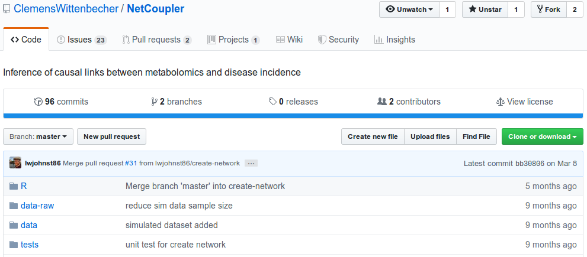
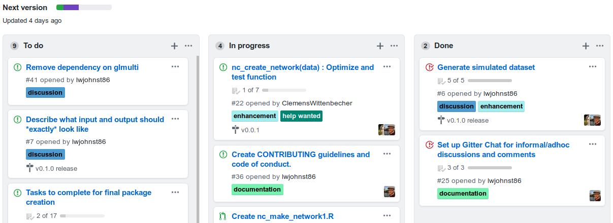

layout: true

<div class="my-footer">
<span>

</span>
</div> 

```{r setup, include=FALSE}
options(htmltools.dir.version = FALSE)

knitr::opts_chunk$set(echo = FALSE)
```

```{r xaringan-themer, include=FALSE}
library(xaringanthemer)
mono_accent(
    base_color = "#105059",
    header_font_google = google_font("Poppins"),
    text_font_google = google_font("Oxygen"),
    text_font_size = "35px"
)
```

---

# Objectives:

- Showcase NetCoupler and its usefulness

- Get feedback on the implementation

---

class: center, middle

# THE PROBLEM

---

## Modern epi studies can generate a lot of metabolic data 

.pull-left[
- More -omics type

- High dimensionality

- Complex networks

- Linking with classic epidemiology
]

--

.pull-right[
Examples:

- Panel of 20-30 fatty acids
- M

]

???

Classic epidemiology meaning having an exposure with an output

---

## "Traditional" analysis may use:

Many regression-type methods:

- M1 

---

## "Traditional" analysis may use:

Dimensionality reduction:

random dag here with PCA output?

---

## "Traditional" analysis may use:

Network analysis:

random dag here

---

## What if we...

<!-- Problem with these analyses... -->

.pull-left[
- want info about network structure?
- don't know the network structure?
- have an exposure, metabolites, and outcome?
- are interested in causal links?
]

--

.pull-right[
Exposure with network with outcome
Exposure and outcome linked

Exposure and network only
Network and outcome only

use inkscape maybe?
]

---

class: center, middle

# THE SOLUTION

---

## NetCoupler: An algorithm that...

- Finds most likely network structure

- Allows inclusion of exposure and outcome

- Identifies causal links between and within network

.footnote[NetCoupler was developed by Clemens Wittenbecher.]

---

## Steps in NetCoupler

1. DAG skeleton of network is estimated
--

2. Initial links formed on exposure(E)-side
--

3. Direct effects estimated between E and network
--

4. Repeat identifying links, find unaffected/ambiguous and delete indirect links
--

5. Initial links formed with outcome(O)-side
--

6. Direct effects estimated between network and O
--

7. Repeat identifying links, delete indirect links and find unaffected/ambiguous
--

8. Combine E-side and O-side estimates into joint model

---

## 1. DAG skeleton of network is estimated


---

## 2. Initial links formed on exposure(E)-side

---

## 3. Direct effects estimated between E and network

---

## 4. Repeat identifying links, find unaffected/ambiguous and delete indirect links

---

## 5. Initial links formed with outcome(O)-side

---

## 6. Direct effects estimated between network and O

---

## 7. Repeat identifying links, delete indirect links and find unaffected/ambiguous

---

## 8. Combine E-side and O-side estimates into joint model

---

class: center, middle

# OUR WORK

---

## NetCoupler current state

- Series of R scripts

--
  
- Only uses specific methods 

???

- Greats well on Clemens' computer
- Not readily re-usable by others

- PC-algorithm for network
- Cox for modelling
- Not easily extensible to other models

---

## Converting to a usable R package

.center[

]

.footnote[Source: https://github.com/ClemensWittenbecher/NetCoupler]

---

## Converting to a usable R package

.center[

]

???

We've got to improve on the underlying implementation, optimize the code for better
speed and performance, fix up the interface so that other methods can be used
like regression or mixed models, and reduce some software dependencies since
right now it relies on software that is really hard to install and get working.

---

## Goals:

- Submit to CRAN[1]

--

- Create simple interface to use

--

- Create website with documentation

--

- Develop tutorials

.footnote[[1] CRAN distributes R packages.]

---

class: center, middle

# Interest? Feedback? Comments?
