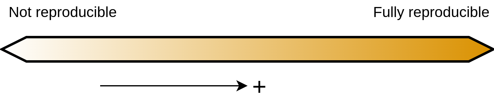

---
# For NCRR
title: "Workshop on reproducibility and open science"
author: Luke W. Johnston
output:
  xaringan::moon_reader:
    lib_dir: libs
    css: "xaringan-themer.css"
    nature:
      slideNumberFormat: ""
      ratio: "16:9"
      countIncrementalSlides: false
---

layout: true

```{r setup, include=FALSE}
options(htmltools.dir.version = FALSE)
knitr::opts_chunk$set(
  echo = FALSE,
  message = FALSE,
  warning = FALSE,
  dev = "CairoPNG",
  dpi = 300,
  fig.path = "images/",
  fig.align = "center"
)

fa2 <- function(icon, fill = "#da9100") {
    fontawesome::fa(name = icon, fill = fill)
}
```

```{css}
.footer-left {
    background-color: #FFFFFF;
    position: absolute;
    bottom: 8px;
    left: 40px;
    height: 60px;
    width: 30%;
    font-size: 12pt;
}

```

```{r xaringan-themer, include=FALSE}
library(xaringanthemer)
style_mono_accent(
    base_color = "#990033",
    base_font_size = "20px",
    text_font_size = "1.2rem",
    header_font_google = google_font("Merriweather Sans", "300")
)
```

```{r data-prep-for-figures, include=FALSE}
library(emoji)  
library(ggplot2)  
library(emojifont)  
library(tidyverse)

study_df <- tribble(
    ~stage, ~icon,
    "question", "fa-question",
    "study design", "fa-clipboard",
    "data", "fa-table",
    "analysis", "fa-line-chart",
    "writing", "fa-pencil",
    "dissemination", "fa-bullhorn"
) %>%
    mutate(
        original = FALSE,
        reproduction = stage %in% c("data", "analysis", "writing"),
        open_science = TRUE
    ) %>% 
    pivot_longer(
        cols = c(original, reproduction, open_science),
        names_to = "study",
        values_to = "state"
    ) %>% 
    mutate(
        study = study %>% 
            str_to_sentence() %>% 
            str_replace("_", " ") %>% 
            fct_inorder(),
        stage = stage %>%
            str_to_sentence() %>%
            fct_inorder() %>%
            fct_rev()
        )

plot_research_stages <- function(data) {
    data %>%
        mutate(icon = fontawesome(icon)) %>%
        ggplot(aes(
            y = fct_rev(study),
            x = fct_rev(stage),
            colour = state
        )) +
        scale_color_manual(values = c("#990033", "#da9100")) +
        geom_text(
            aes(label = icon),
            family = 'fontawesome-webfont',
            size = 12,
            show.legend = FALSE
        ) +
        coord_equal() +
        theme_minimal() +
        theme(
            plot.margin = margin(t = -3, l = -0.5),
            text = element_text(size = 12),
            axis.title.x = element_blank(),
            axis.title.y = element_blank(),
            panel.grid = element_blank()
        )
}
```

.footer-left[
Slides: [slides.lwjohnst.com/au/2022-04-25](https://slides.lwjohnst.com/au/2022-04-25/)  
Licensed under CC-BY `r fa2("creative-commons-by", "#990033")`
]

---

```{r progress-bar}
xaringanExtra::use_progress_bar(color = "#990033", location = "top")
```

```{r logo-sdca}
xaringanExtra::use_logo(
  image_url = "../../common/sdca-logo.png",
  link_url = "https://www.stenoaarhus.dk/",
  width = "60",
)
```

<!-- 
70 min: 

- 2 * 10 min activity
- 2 * 

Introduce myself and my work.

- My work and R courses?
    - DDA
    - I know that several people from NCRR have taken my R course

-->

--

## `r fa2("list", "#990033")` Outline

- Learning objectives

- Main take-home message

- Introduce and describe reproducibility and open science

- Activities to discuss and brainstorm

- Resources

---


## Learning objectives of this workshop: 

1. Become aware of what reproducible and open practices are

--

2. Hear and learn about what the experiences and thoughts of your colleagues are

--

3. Learn about some simple ways to become more open and reproducible

--

4. Identify ways to adopt some of these practices at NCRR (1)

.footnote[(1): NCRR and any work on DST has unique challenges.]

---

class: middle

**Take-home message:**

## Publicly share your code from your research

???

And I will add, share you code at *any* stage of your research. From beginning,
to end, to middle.

---

class: middle

## Why are reproducible and open practices important right now? `r emoji("thinking")`

**They are part of multiple large trends like team science, computing, meta-research, higher quality/rigor**

???

(Raise of hands) How many could describe the difference between reproducibility
and replicability?

---

## Reproducibility: Same data + analysis = same result? 

```{r fig-reproducibility, out.width="85%", fig.width=6, fig.height=2}
study_df %>% 
    filter(study != "Open science") %>% 
    plot_research_stages()
```

- Also called analytic/computational reproducibility or reproducible data
analysis.
- *Independently* reproduce results in paper based on same analysis and data.

---

## Reproducibility is a spectrum

```{r fig-spectrum-reproducibility, out.width="80%"}

```

.footnote[
Just as much about *inspectability* as it is about *actual* reproducibility.
]

???

Part of this workshop and a lot of my teaching and work is to get that us as a
community to move closer to this end.

Reproducibility is about HOW EXACTLY a finding was found in a study.

---

## 6 min activity: Think `r emoji("thought_balloon")`about your research workflow, then share `r fa2("comments")`

- For 4 min, *to yourself*, think what your workflow is *exactly* like for doing
research. As you think of them, add them to the Mentimeter, until the time runs out.
    - Where do you save your files? How do you name your files?
    - What apps do you use?
    - How do you know which files to work on and where you left off?
    - How do you keep track of tasks to do?
    - How do you collaborate and coordinate with others? Email? Shared folders?

- For 2 min, as the whole group we'll briefly go over some of the workflow items.

???

This helps to get us thinking and mentally primed for later activities.

---

## Reproducibility as a spectrum

```{r fig-spectrum-reproducibility-2, out.width="80%"}

```

--

\+ One folder per manuscript (with associated files)  
\+ Relative file paths used (`data/project-data.csv` vs `C:/User1/some-data-file.csv`)  
\+ Version controlled (like with Git)  
\+ Automated and explicit pipeline management (re-generate results with single command)  
\+ Reproducible document system

???

- I wanted you to think about your workflow so you can start appreciating
how even small things can be changed to improve reproducibility.

- And if more reproducible, if things change, its easier to update later work
with literally a push of a button (or single command)

- Some things are easier to do than others, and some require more technical
knowledge and skill than most researchers have the time or motivation to
acquire. (More about encouraging these skills).

- But, we're missing key component here...

---

class: middle

## Key `r fa2("key")` component: Using the same data and analysis to *independently* get the same result

???

If you were to give me your code and I had access to your data, would 
I know how you got any given result presented in your paper?

---

## Open science occurs at all stages of research

```{r fig-open-science, out.width="80%", fig.width=6, fig.height=2.75}
study_df %>% 
    plot_research_stages()
```

???

Components of open science are in all stages of research.

---

## Open science is also a spectrum 

```{r fig-spectrum-open-science, out.width="80%"}

```

\+ Open access (like preprints)  
\+ Open protocol  
\+ **Open data/data format**  
\+ **Open analysis plan/code**  
\+ **Open source (like software used)** (1)

.footnote[(1): Example, AU institutionally approves and supports a closed source
software (Stata), reducing reproducibility.]

???

Focus down to reproducibility side (data, code).

E.g. AU has institutionally approved a closed source statistical software
(Stata), which by definition, makes work less open and reproducible (someone
else needs a Stata license to run your software), unlike open source software
like R where anyone can install and run it.

---

## 5 min activity: Think `r emoji("thought_balloon")` and share `r fa2("comments")` about potential *benefits*

> What might be some ***benefits*** to being more reproducible and open at NCRR
at the organizational, group, and/or individual level (from the trainee to those
more established)?

- For 1 min, *to yourself*, think about the question.

- For 2 min, discuss with your neighbour what you've thought about.

- For 2 min, we'll have a group-wide sharing of some of the thoughts.

---

## 5 min activity: Think `r emoji("thought_balloon")` and share `r fa2("comments")` about potential *barriers*

> What might be some ***barriers*** to being more reproducible and open at NCRR
at the organizational, group, and/or individual level (from knowledge and technical
capacity, to what gets supported and what doesn't)?

- For 1 min, *to yourself*, think about the question.

- For 2 min, discuss with your neighbour what you've thought about.

- For 2 min, we'll have a group-wide sharing of some of the thoughts.

---

## Possible social and technical actions to moving toward openness and reproducibility 

--

.pull-left[
- Do code reviews, pair programming/analysis

- Reviewing (pre-analysis)
    - Data cleaning plan 
    - Data analysis plan

- Discuss with DST to support reproducible/open systems (within law)
]
    
--

.pull-left[
- **Publicly link your code with your research output** using GitHub and Zenodo

- Decide on standard folder and file structure for each project/manuscript
]

???

Now that we're getting more into thinking about benefits and barriers, we
can get into thinking about potential actions to take to be more reproducible and 
open. Before getting into brainstorming activities, I want to give you some
ideas for actions to help prime your thinking.

- Work with/pressure DST to make it easier to download code from server to
eventually share (something we'll start doing more at SDCA)
  
---

## 10 min activity: Think `r emoji("thought_balloon")`, brainstorm, then share `r fa2("comments")` *short-term, easier* options

> What are some potential options that you, your group, and NCRR could
implement *relatively easily and within the short-term (<1 year)* to be more
open and reproducible?

- For 2 min, think about ideas to this question (and write down if you want to)

- For 3 min, brainstorm with your neighbour(s) on what you've all thought about

- For 2 min, decide on one person to write down some of the ideas in the Mentimeter

- For 3 min, we'll briefly go over and discuss some ideas from the Mentimeter

---

## 10 min activity: Think `r emoji("thought_balloon")`, brainstorm, then share `r fa2("comments")` *long-term, more difficult* options

> What are some potential options that you, your group, and NCRR could implement
that are *more difficult and within the longer-term (>2 years)* to be more open
and reproducible?

- For 2 min, think about ideas to this question (and write down if you want to)

- For 3 min, brainstorm with your neighbour(s) on what you've all thought about

- For 2 min, decide on one person to write down some of the ideas in the Mentimeter

- For 3 min, we'll briefly go over and discuss some ideas from the Mentimeter

---

## Resources

- Introduction course to Reproducible Research in R: 
[r-cubed.rostools.org](https://r-cubed.rostools.org/)
    - [Further learning resources](https://r-cubed.rostools.org/resources.html#further-learning)

- Intermediate course to Reproducible Research in R:
[r-cubed-intermediate.rostools.org](https://r-cubed-intermediate.rostools.org/)
    - [Further learning resources](https://r-cubed-intermediate.rostools.org/resources.html#for-continued-learning)
