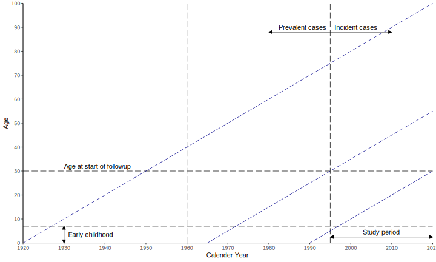
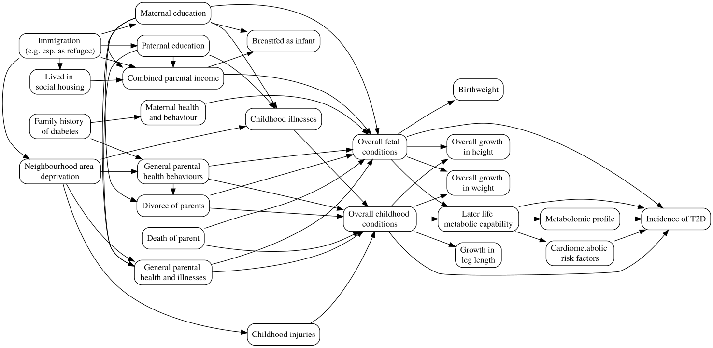

layout: true

<div class="my-footer">
<span>

 
</span>
</div> 

```{r setup, include=FALSE}
options(htmltools.dir.version = FALSE)
library(kableExtra)
library(tidyverse)
library(fontawesome)
knitr::opts_chunk$set(
  echo = FALSE,
  dev = "png",
  dpi = 150,
  comment = "#>",
  message = FALSE,
  warning = FALSE,
  fig.align = "center"
)

image_nc_path <- function(.file) {
    here::here("au-ph", "2019-08-15", "images", .file)
}
```

```{r xaringan-themer, include=FALSE}
library(xaringanthemer)
mono_accent(
    base_color = "#214c78",
    text_font_size = "28px",
    header_font_google = google_font("Monda"),
    text_font_google = google_font("Rosario")
)
```

---

# Outline:

- Project description
- Plans during funding
- Future perspectives
- Challenges

---

class: center, middle

# MELD Project Description

---

## Brief introduction

- Early life influences risk for diabetes
- How metabolic processes mediate link? `r emo::ji("shrug")`
- Difficult to study due to long timespans
- Easier now with:
    - Long term registers
    - Cohort `r emo::ji("link")` registers
    - Powerful mediation methods

.footnote[[lwjohnst.gitlab.io/dda-pdf](https://lwjohnst.gitlab.io/dda-pdf/)]

---

## Research questions:

- *Aim*: to quantify and understand impact of early life conditions on adult
metabolic capacity and risk for T2D.

### Objectives

1. Investigate how specific early life conditions affect risk of T2D nationally
1. Extend and generalise NetCoupler algorithm 
([github.com/NetCoupler](https://github.com/NetCoupler/NetCoupler))
    - Estimates direct and mediating pathways in high dimensional metabolic data
1. Identify mediating pathways of metabolic capacity between early
life adversity and T2D using NetCoupler

---

## Methods: Population

```{r img-lexis, out.width="80%"}

```

---

## Methods: Variables

```{r img-dag, out.width="85%"}

```

---

## Methods: Analysis process

```{r img-methods, out.width="70%"}

```

---

## Model to handle data that looks like:

```{r img-model-handles-data, out.width="75%"}
knitr::include_graphics(image_nc_path("network.png"))
```

---

## NetCoupler: A causal structure learning algorithm that...

.pull-left[
- Finds most likely network structure

- Allows inclusion of exposure and outcome

- Identifies causal links between and within network
]

.pull-right[

]

.footnote[NetCoupler algorithm was developed by Clemens Wittenbecher.]

---

## NetCoupler procedure

```{r img-netcoupler, out.width="75%"}
knitr::include_graphics("images/netcoupler-process.svg")
```

.footnote[`r emo::ji("package")` [github.com/NetCoupler](https://github.com/NetCoupler)]

---

## Infer (potentially) causal pathways with graphical model

```{r img-netcoupler-end-goal, out.width="85%"}
knitr::include_graphics(image_nc_path("nc-causal-pathways.png"))
```

---

### General timeline 

```{r img-timeline}

```

---

# Plans

- Adhere even more to open scientific practices
    - E.g. developing protocol to register study[1]
- Research stays in Boston to work with collaborator

.footnote[[1] MELD Project Protocol: [lwjohnst.gitlab.io/meld-protocol](https://lwjohnst.gitlab.io/meld-protocol)]

---

class: center, middle

# Future Perspectives

---

## For project

- Lots of potential for other `r emo::ji("question")`
    - Cohort `r emo::ji("link")` registers
    - Application of causal learning algorithm
- Gain expertise in working with registers
- Potential to get `r emo::ji("heavy_dollar_sign")` to expand project

---

## For career

- Develop and expand my network in Europe
- Get more `r emo::ji("man_technologist")``r emo::ji("woman_technologist")` to work with
- Co-mentor PhD student

---

# Challenges:

- Navigating Statistics Denmark website and documentation 
- Translating Danish words for variables and registers 
    - ... and knowing what to look for
- Finding other datasets to use for linkage
- Balancing my time with other projects
