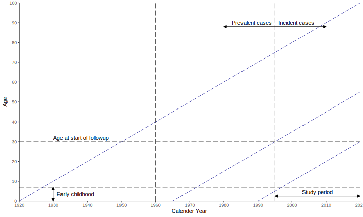
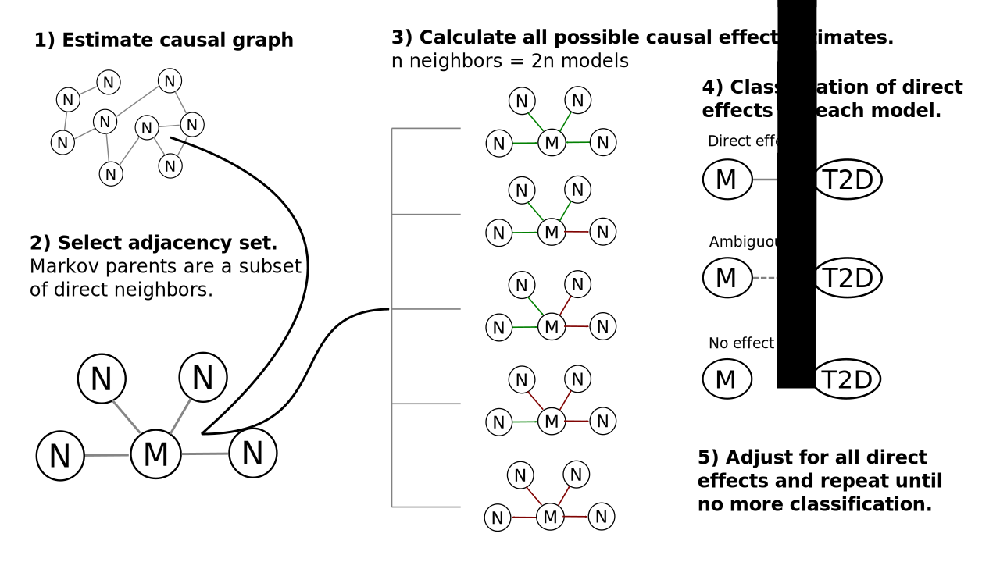

layout: true

<div class="my-footer">

 
</div> 

<div class="my-header">
`r lwj::qrencode_svg("https://slides.lwjohnst.com/dda/2020-02-04/")`
</div> 

```{r setup, include=FALSE}
options(htmltools.dir.version = FALSE)
library(kableExtra)
library(tidyverse)
knitr::opts_chunk$set(
  echo = FALSE,
  dev = "png",
  dpi = 150,
  comment = "#>",
  message = FALSE,
  warning = FALSE,
  fig.align = "center"
)
```

```{r xaringan-themer, include=FALSE}
library(xaringanthemer)
mono_accent(
    base_color = "#105059",
    header_font_google = google_font("Poppins"),
    text_font_google = google_font("Oxygen"),
    text_font_size = "25px"
)
```

---

# Outline:

- Project description
- Plans during funding
- Future perspectives
- Challenges

---

class: center, middle

# MELD Project Description

---

## Brief intro:

- Early life shown to influence risk of diabetes
- Not known how metabolic processes mediate this link
- Difficult to study due to long timespans
- Easier now with:
    - Registers
    - Cohort linkages
    - Powerful mediation methods

.footnote[[lwjohnst.gitlab.io/dda-pdf](https://lwjohnst.gitlab.io/dda-pdf/)]

---

## Research questions:

- *Aims* to better quantify and understand impact of early life conditions on
adult metabolic capacity and risk for T2D. 

### Objectives

1. Investigate how specific early life conditions affect risk of T2D at 
national level
1. Extend and generalise NetCoupler algorithm 
([github.com/NetCoupler](https://github.com/NetCoupler/NetCoupler))
    - Estimates direct and mediating pathways in high dimensional metabolic data
1. Identify mediating pathways of metabolic capacity between early
life adversity and T2D with NetCoupler

---

## Methods: Population

```{r img-lexis, out.width="80%"}

```

---

## Methods: Variables

```{r img-dag, out.width="85%"}
knitr::include_graphics("dag.svg")
```

---

## Methods: Analysis process

```{r img-methods, out.width="70%"}

```

---

## NetCoupler: Causal structure learning

```{r img-netcoupler, out.width="75%"}

```

.footnote[[github.com/NetCoupler](https://github.com/NetCoupler)]

---

### General timeline 

```{r img-timeline}

```


---

# Plans

- Adhere more to open scientific practices
    - E.g. developing protocol to register study[1]
- Research stays in Boston to work with collaborator

.footnote[[1] MELD Project Protocol: [lwjohnst.gitlab.io/meld-protocol](https://lwjohnst.gitlab.io/meld-protocol)]

---

class: center, middle

# Future Perspectives

---

## For project

- Lots of future potential with this project
    - Cohort and register linkage
    - Application of causal learning algorithm
- Gain expertise in working with registers
- Potential to get grants to expand project

---

## For career

- Develop and expand my network in Europe
- Get more collaborators to work with
- Co-mentor PhD student

---

# Challenges:

- Navigating Statistics Denmark website and documentation 
- Translating Danish words for variables and registers 
    - ... and knowing what to look for
- Finding other datasets to use for linkage
- Balancing my time with other projects
