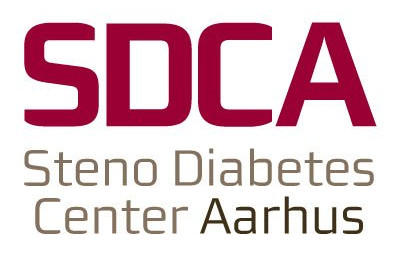

layout: true

<div class="my-footer">
<span>


<a href="https://slides.lwjohnst.com/misc/2021-01-08/">slides.lwjohnst.com/misc/2021-01-08</a>
</span>
</div> 

```{r setup, include=FALSE}
options(htmltools.dir.version = FALSE)
library(fontawesome)
knitr::opts_chunk$set(
  echo = FALSE,
  dev = "png",
  dpi = 150,
  comment = "#>",
  message = FALSE,
  warning = FALSE,
  fig.align = "center"
)

image_misc_path <- function(.file) {
    fs::path("..", "..", "misc", "2021-01-08", "images", .file)
}

fa2 <- function(.icon) {
    fontawesome::fa(name = .icon, fill = "#105059")
}
```

```{r xaringan-themer, include=FALSE}
library(xaringanthemer)
style_mono_accent(
    base_color = "#105059",
    base_font_size = "30px",
    code_font_size = "1rem",
    header_h1_font_size = "60px",
    header_h2_font_size = "42px",
    header_font_google = google_font("Monda"),
    text_font_google = google_font("Rosario")
)
```

<!-- About 4-5 min long -->

---

# Who am I?

.pull-left[
- I'm Luke Johnston `r emo::ji("wave")` 
- `r fa2("briefcase")`: Postdoctoral researcher
- `r fa2("globe-europe")`: Steno Diabetes Center Aarhus, Denmark
- `r fa2("user-graduate")`: 
    - BSc in Kinesiology from University of Waterloo
    - MSc and PhD in Nutritional Sciences from UofT
]

.pull-right[
```{r, out.width="60%"}
knitr::include_graphics(image_misc_path("luke-pic.jpg"))
```
]

.footnote[More details: [cv.lukewjohnston.com](https://cv.lukewjohnston.com/)]

---

# Career path `r fa2("route")` 

- High school: `r emo::ji("thinking")` in sports medicine

--

- Bachelor in Kinesiology: `r emo::ji("thinking")` in Nutrition

--

- MSc and PhD in Nutrition: `r emo::ji("thinking")` in statistics, epidemiology,
and software development

--

- Postdoc in diabetes epidemiology: `r emo::ji("thinking")` in teaching stats +
programming and in software and method development

---

# Research from PhD `r fa2("user-graduate")`

1. *Clusters of fatty acids in the serum triacylglyceride fraction associate
with the disorders of type 2 diabetes*. (2018). DOI: 10.1194/jlr.P084970.

2. *Association of non-esterified fatty acid composition with insulin
sensitivity and beta cell function in the Prospective Metabolism and Islet Cell
Evaluation (PROMISE) cohort*. (2017). DOI: 10.1007/s00125-017-4534-6.

3. *Longitudinal associations of phospholipid and cholesteryl ester fatty acids
with disorders underlying diabetes.*. (2016). DOI: 10.1210/jc.2015-4267.

???

Overall objective of my PhD was to investigate how types of fatty acids in the
blood might influence risk for type 2 diabetes.

---

## One `r emo::ji("key")` finding: Triglycerides related to *de novo* lipogenesis may `r fa2("arrow-up")` diabetes risk

```{r, out.width="35%"}
knitr::include_graphics(image_misc_path("pls-tag-isi.png"))
```

---

# Some current research projects

--

- MELD project: Studying how early life influences metabolism and risk
for diabetes using the Danish national registers (e.g. Cause of Death Register,
Birth Register).
    - `r fa2("link")`: [lwjohnst.gitlab.io/dda-pdf](https://lwjohnst.gitlab.io/dda-pdf/)

--

- NetCoupler: Statistical method and R package `r emo::ji("package")` to find
links between metabolism and disease (like diabetes).
    - `r fa2("link")`: [netcoupler.github.io/netcoupler](https://netcoupler.github.io/NetCoupler/)

--

- r-cubed: Training material on using modern tools for scientific data analysis.
    - `r fa2("link")`: [r-cubed.rostools.org](https://r-cubed.rostools.org/)

---

# `r emo::ji("thought")` Future and general advice

- Things I've learned:
    - High need for computational `r emo::ji("computer")` skills, tools, and
    training in research
    - Academia has many many major flaws that need fixing `r emo::ji("wrench")`
    - Working in research is very rewarding and amazing! 

--

- Biggest pieces of advice: 
    - Follow what interests and motivates you
    - Enjoy and cultivate relationships with others (you may end up collaborating
    together!)

# Outline

# Course arose from need for skills in data analysis emoji coding

## ... and awareness of reproducibility and open science emoji mind explode

.footnote[
- Link to material
- JOSE paper: DOI
]

???

- This course arose from a need

# Why not use existing material from e.g. Carpentries? emoji thinking

- No strong narrative thread
- Jumping around with concepts without reusing them again later
- Using older workflows/packages
- Emphasis/focus on writing software
- Not targeted to biomedical researchers

# Key principles when developing material

- Be openly licensed and publicly accessible for more re-use
- Emphasize creating a safe and supportive environment that empowers
participants to engage, question, and learn
- Use modern and beginner-friendly software and workflows
- Use evidence-based learning and teaching practices
- Designed material for the participants as well as potential and new
instructors
- Include strong narrative thread throughout entire content

## Feedback

- What worked well
- What to improve

# What worked

## Consistent and strong positive feedback on material being online and easily accessible

## 

# What needed to improve

## Consistent feedback on NOT deviating from online material

## SLOW DOWN and limit moving between applications on screen

# Tried out:

## Reading

- Why try it out? We 


- That we followed
- Consistently strong feedback on having material easily accessible online that we followed, so if any got lost

1. Incorporate and weave in reading, listening, doing, and discussing *in class*.
2. Encourage past participants to instruct workshops, and give them documentation and support for onboarding them.
3. Emphasize the code of conduct and the safety of the learning space, and *embody* it.
4. Provide the material online, easily accessible, and follow it exactly. Deviate as little as possible, and only if relevant. (optional)
