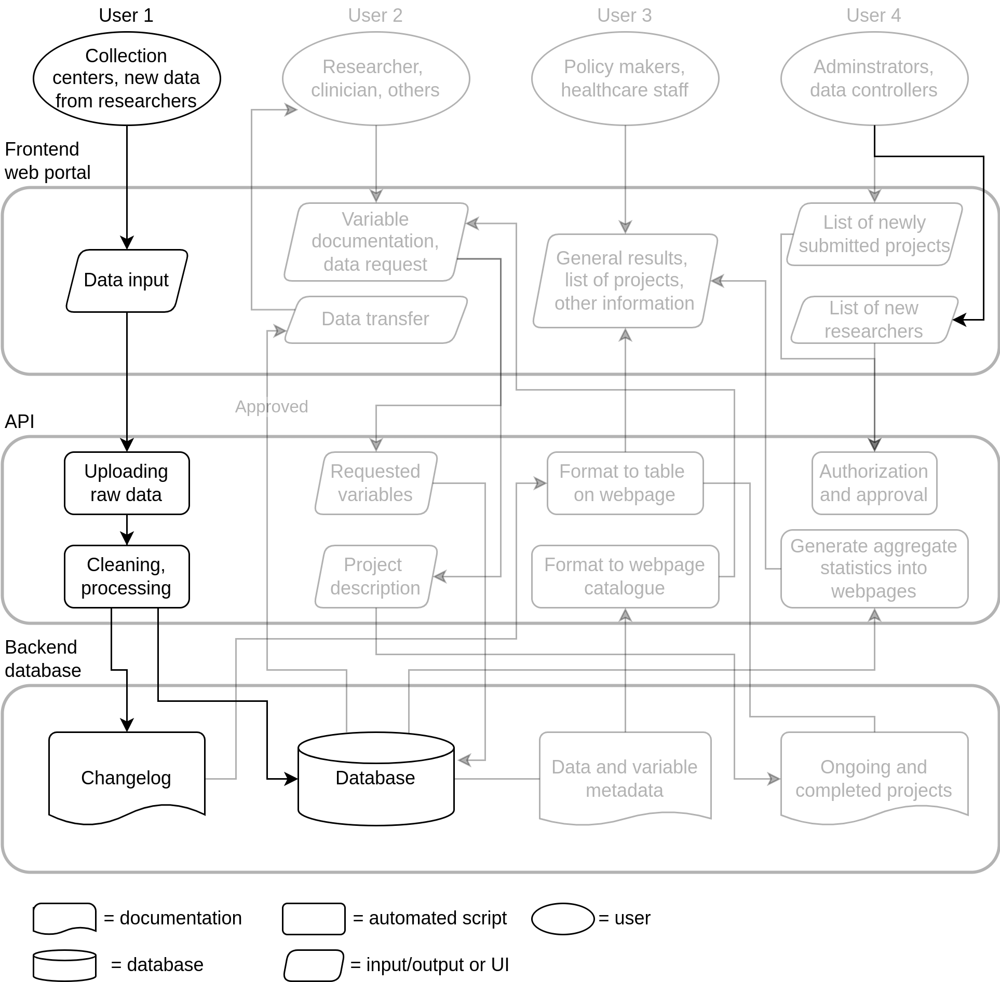

---
# For DD2 
title: "Implementing an open and scalable infrastructure for the DD2 data"
output:
  xaringan::moon_reader:
    lib_dir: libs
    css: "xaringan-themer.css"
    nature:
      slideNumberFormat: ""
      ratio: "16:9"
      countIncrementalSlides: false
---

layout: true

```{r setup, include=FALSE}
options(htmltools.dir.version = FALSE)
knitr::opts_chunk$set(
  echo = FALSE,
  message = FALSE,
  warning = FALSE,
  fig.align = "center"
)
library(emoji)

fa2 <- function(icon) {
    fontawesome::fa(name = icon, fill = "#da9100")
}
```

```{css}
.footer-right {
    background-color: #FFFFFF;
    position: absolute;
    bottom: 10px;
    right: 8px;
    height: 60px;
    width: 30%;
    font-size: 11pt;
}
```

```{r xaringan-themer, include=FALSE}
library(xaringanthemer)
style_mono_accent(
    base_color = "#990033",
    base_font_size = "22px",
    text_font_size = "1.3rem", 
    text_font_google = google_font("Nanum Gothic"),
    header_font_google = google_font("Merriweather Sans", "300")
)
```

.footer-right[
Website: [steno-aarhus.github.io/dif-project](https://steno-aarhus.github.io/dif-project)  
Slides: [slides.lwjohnst.com/misc/2022-08-15](https://slides.lwjohnst.com/misc/2022-08-15/)
]

---

```{r progress-bar}
xaringanExtra::use_progress_bar(color = "#990033", location = "top")
```

```{r logo-sdca}
xaringanExtra::use_logo(
  image_url = "../../common/sdca-logo.png",
  link_url = "https://www.stenoaarhus.dk/",
  width = "60",
)
```

???

<!-- 
Details:  

- ~20 min presentation
- Specific to DD2
- Informal, ask questions
- More discussion based

Outline:

- Aims
- General description of DIF (image)
- Short-term plan
- Questions
    - In discussion with company to help, Jens give details?
        - How can we fit in with those plans?
    - Timeline for hiring data manager?
        - Data manager to map all data, resources, and documentation
-->

**Setting the stage**

- Or, you are a large, multi-national/center consortium that wants to keep better
track of who's working on what, and how to discover and share data added to the
project... or has an aim of widely disseminating their data for maximal, and
cost-effective, use by their collaborators and others.

All of these could use the framework to abide by the best practices in FAIR data
management.

---

## Aims of the Data Infrastructure Framework (DIF) Project 

???

We're still working out a better name, but for now we're calling it DIF

These aims are for the full project itself, and may seem vague, but bare with me.

--

1. **Primary aim**: Create and implement an efficient, scalable, and open source
data infrastructure framework that connects data collectors, researchers,
clinicians, and other stakeholders, with the data, documentation, and findings
(starting within the DD2 study)

--

2. **Secondary aim**: Create this framework so that *other research groups and
companies*, who are unable or can't build something similar, can relatively
easily implement it and modify as needed for their own purposes.

--

> In short: Make a software product that makes it easier to find, store, and
use data for research projects that abide by best practices, and make it so
that it is easy and free to use for others.

???

Again, these might not be really tangible to grasp what this actually means.

---

## `r fa2("compass")` Guiding principles 

1. Follow and enable FAIR principles

2. Openly licensed and re-usable (e.g. CC-BY, MIT) 

3. State-of-the-art principles and tools in software and UI design

4. Friendly to beginner and non-technical users

???

---

```{r fig-detailed-schematic, out.width="58%"}
knitr::include_graphics("images/detailed-schematic.png")
```

---

```{r fig-layers, out.width="58%"}
knitr::include_graphics("images/layers.png")
```

---

```{r fig-user-1, out.width="58%"}

```

---

```{r fig-user-2, out.width="58%"}

```

---

```{r fig-user-3, out.width="58%"}
knitr::include_graphics("images/user-3.png")
```

---

```{r fig-user-4, out.width="58%"}

```

---

## Short-term plan `r fa2("map-marked")`

> [Full 5 year timeline found on website.](https://steno-aarhus.github.io/dif-project/#deliverables-and-milestones)

- Hire software/data engineers and build team as soon as possible

- Developing "Minimum Viable Product" of first component within ~2 years

- Emphasize making training and documentation targeted to non-technical users throughout project
