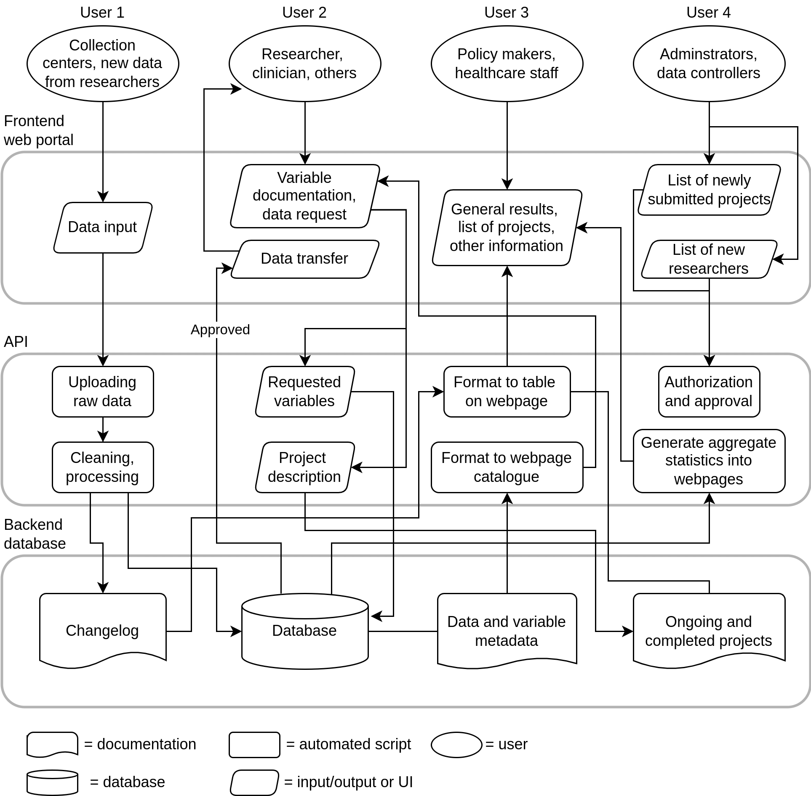
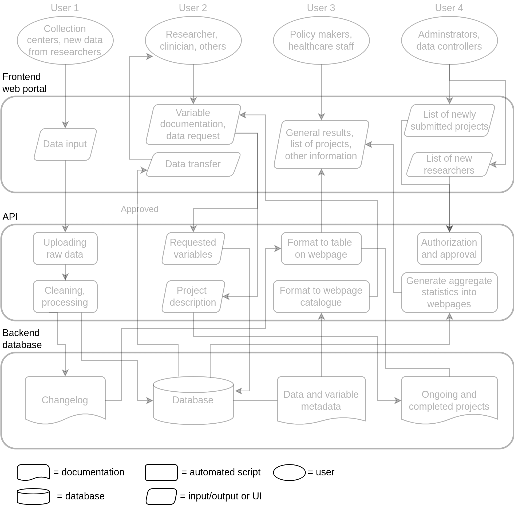
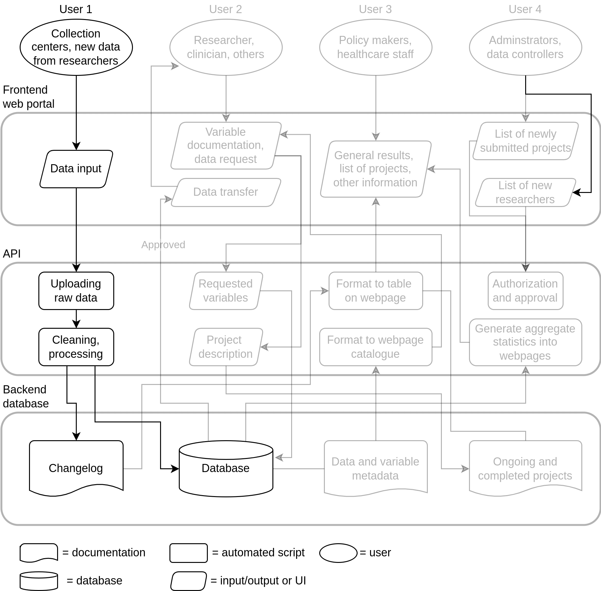
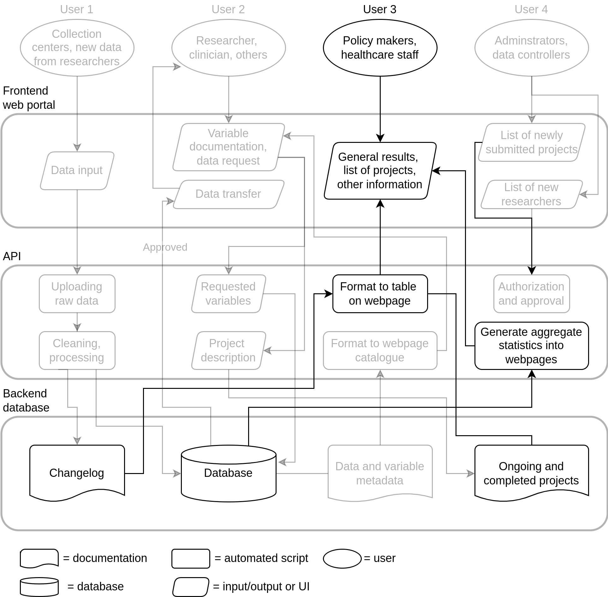
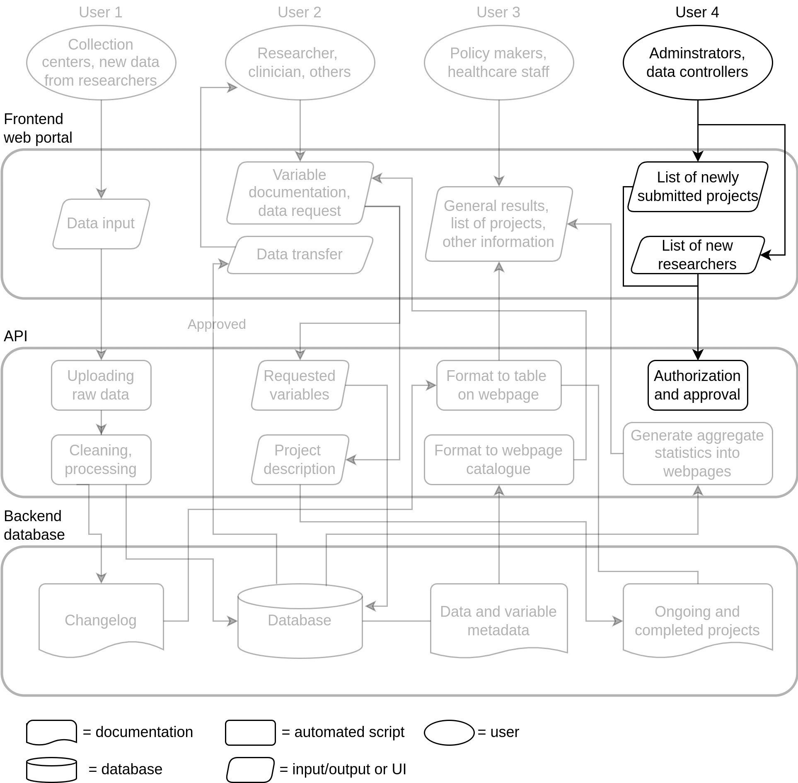

---
# For Clemens group at Chalmers
title: "Approaches to open, scalable, and reproducible data management and analysis: Training and software"
output:
  xaringan::moon_reader:
    lib_dir: libs
    css: "xaringan-themer.css"
    nature:
      slideNumberFormat: ""
      ratio: "16:9"
      countIncrementalSlides: false
---

layout: true

```{r setup, include=FALSE}
options(htmltools.dir.version = FALSE)
knitr::opts_chunk$set(
  echo = FALSE,
  message = FALSE,
  warning = FALSE,
  fig.align = "center"
)
library(emoji)

fa2 <- function(icon, fill = "#da9100") {
    fontawesome::fa(name = icon, fill = fill)
}
```

```{css}
.footer-right {
    background-color: #FFFFFF;
    position: absolute;
    bottom: 10px;
    right: 8px;
    height: 60px;
    width: 30%;
    font-size: 11pt;
}
```

```{r xaringan-themer, include=FALSE}
library(xaringanthemer)
style_mono_accent(
    base_color = "#990033",
    base_font_size = "20px",
    text_font_size = "1.1rem",
    text_font_google = google_font("Nanum Gothic"),
    header_font_google = google_font("Merriweather Sans", "300")
)
```

.footer-right[
Slides: [slides.lwjohnst.com/misc/2022-08-17](https://slides.lwjohnst.com/misc/2022-08-17/)
Licensed under CC-BY `r fa2("creative-commons-by", "#990033")`
]

---

```{r progress-bar}
xaringanExtra::use_progress_bar(color = "#990033", location = "top")
```

```{r logo-sdca}
xaringanExtra::use_logo(
  image_url = "../../common/sdca-logo.png",
  link_url = "https://www.stenoaarhus.dk/",
  width = "60",
)
```

<!--
Details:

- Stimulate scientific discussion
- ~30 min + discussion (~45 min total?)

Outline (do in order but don't need to complete):

- DIF Project
- r-cubed

-->

# Outline: My current projects

1. NNF-funded Data Infrastructure Framework (DIF) Project

2. Reproducible Research in R hands-on courses with Danish Diabetes Academy

???

We'll go through this outline in this order, not expecting to cover them all.

---

class: middle

# Data Infrastructure Framework (DIF) Project

???

**Setting the stage**

Imagine that you are a new professor, just starting getting a group and research
programme going... or solo researcher or a small research group starts a study
to have data for their PhD students, but have limited funds and technical
expertise.

- Or, you are a small startup company trying get investment and build income
quickly... in the research realm so need to follow best practices/requirements
for data management... relies on data collection for business. Needs to get
operational quickly, but doesn't yet have funds to hire technical personnel.

- Or, you are a large, multi-national/center consortium that wants to keep better
track of who's working on what, and how to discover and share data added to the
project... or has an aim of widely disseminating their data for maximal, and
cost-effective, use by their collaborators and others.

All of these could use the framework to abide by the best practices in FAIR data
management.

---

## Aims of the DIF Project

???

We're still working out a better name, but for now we're calling it DIF

These aims may seem vague, but bare with me.

--

1. **Primary aim**: Create and implement an efficient, scalable, and open source
data infrastructure framework that connects data collectors, researchers,
clinicians, and other stakeholders, with the data, documentation, and findings
(starting within the DD2 study)

.footnote[Check out [DIF Project Website](https://steno-aarhus.github.io/dif-project/) for more details.]

???

Just for some clarification, infrastructure here meaning the computational
structure of the data and all its support structures, for instance, how the files
and folders are structured, where the data files are saved and what file format,
how to connect to data. In many ways like the roads and buildings of a city,
where data is the people moving about.

"Framework" on the other hand is the bundle or package that contains the
instructions to create an infrastructure, that someone can take and use to
create the infrastructure somewhere else. You can think of this as the blueprint
for building a city.

--

2. **Secondary aim**: Create this framework so that *other research groups and
companies*, who are unable or can't build something similar, can relatively
easily implement it and modify as needed for their own purposes.

--

> In short: Make a software product that makes it easier to find, store, and
use data for research projects that abide by best practices, and make it so
that it is easy and free to use for others.


???

Again, these might not be really tangible to grasp what this actually means.

---

class: middle

## Why is this important? `r emoji("thinking")`

**Large trends across science in computing, data quantity, accountability, transparency**

???

Increasing need in science for...

- Computational tools and technologies
- Secure and reliable IT infrastructure
- Greater openness and transparency
- More reproducibility of studies
- Highly technical skills and knowledge
*... especially in relation to data management.*

Questions like:

- How do store your data? In what file format?
- Where do you store your data and how do you name the files?
- How do you keep track of changes to the data?
- (For multi-center studies) Who has which datasets and how do you combine them together?
- How do you or your collaborators find out what variables there are in the data, what do they mean?
- When there are errors or problems in your data, and you've already published
with or analyzed on it, how can you easily determine which publications used the
in correct data and how can you easily update the publications with the correct
data?
- How can you easily share your data with colleagues or reviewers to check your
findings?

---

class: middle

## Past and current barriers `r fa2("lock")`: Lack of funding, awareness, understanding, skill, and knowledge

???

- Funding agencies don't fully recognize these challenges, so don't provide
funding
- Researchers aren't aware of or understand the issues, or don't have skills to tackle them
- People with needed technical skills leave for industry

---

class: middle

## Recent new funding `r emoji("money_bag")`: NNF Data Science Research Infrastructure 5 year grant

.footnote[Which lead to this DIF Project and getting the funding for it `r emoji("star-struck")`]

???

Development of new ... methods and technologies within data science, ..., data
engineering, ...

---

## `r fa2("compass")` Guiding principles

1. Follow and enable FAIR principles

2. Openly licensed and re-usable (e.g. CC-BY, MIT)

3. State-of-the-art principles and tools in software and UI design

4. Built from software that may be more familiar to researchers/academia

5. Friendly to beginner and non-technical users

???

FAIR = Findable Accessible Interoperable Reusable

---

```{r fig-detailed-schematic, out.width="58%"}

```

---

```{r fig-layers, out.width="58%"}

```

---

```{r fig-user-1, out.width="58%"}

```

---

```{r fig-user-2, out.width="58%"}
knitr::include_graphics("images/user-2.png")
```

---

```{r fig-user-3, out.width="58%"}

```

---

```{r fig-user-4, out.width="58%"}

```

---

class: middle

## Interested in being involved or learning more? `r emoji("geek")` Let me know! `r emoji("raising_hand")`

.footnote[Check out [DIF Project Website](https://steno-aarhus.github.io/dif-project/).]

---

class: middle

# Reproducible Research in R (r-cubed) courses

---

class: middle

## Reproducibility, a core principle of science, is rarely done

- Reproducibility: Same data + same analysis = same results?
- Replication: Same design + different data + same analysis = same results?

???

- *Non-replication* is a known major problem, but extent of non-reproducible
results is unknown. Barriers to addressing the problem include:
    - Lack of incentives to be reproducible
    - Emphasis on novelty and original work

---

## We don't share as much as we should

.footnote[
There are few studies on the extent of code and data availability, and whether study results
can be reproduced. Figure shows results of some of them:
1) [10.1177/2515245920918872](https://doi.org/10.1177/2515245920918872),
2) [10.1007/s11306-017-1299-3](https://link.springer.com/article/10.1007/s11306-017-1299-3),
3) [10.1371/journal.pone.0251194](https://journals.plos.org/plosone/article?id=10.1371/journal.pone.0251194).
]

```{r fig-sharing, fig.width=7, fig.height=3, out.width="80%", dpi=300}
library(tidyverse)
tribble(
    ~study, ~text, ~value, ~total,
    1,"Data available", 41, 62,
    1,"Code available", 37, 62,
    1,"Could reproduce", 21, 62,
    2,"Data available", 2, 27,
    2,"Code available", 1, 27,
    2,"Could reproduce", 0, 27,
    3,"Data available", 14, 57,
    3,"Code available", 1, 57,
    3,"Could reproduce", 7, 57,
) %>%
    mutate(
        study = fct_recode(
            as_factor(study),
            "Registered Reports\nin Psychology (n=62) [1]" = "1",
            "Systematic review of\nmetabolomics studies\n(n=27) [2]" = "2",
            "Reproducing longitudinal\nanalyses in PLOS ONE\n(n=57) [3]" = "3"
        ),
        text = fct_rev(fct_inorder(text)),
        value = round((value / total) * 100, 0)
    ) %>%
    ggplot(aes(x = text, y = value, label = paste0(value, "%"))) +
    geom_col(fill = "#8b0000", width = 0.7) +
    geom_text(nudge_y = 10) +
    theme_minimal() +
    coord_flip(ylim = c(0, 100)) +
    facet_grid(cols = vars(study), scales = "free") +
    labs(y = "Percent of articles",
         title = "") +
    theme(
        axis.title.y = element_blank(),
        panel.grid = element_blank(),
        axis.text.x = element_blank(),
        axis.title.x = element_text(colour = "grey20", size = 10)
    )
```

???

- Estimating the reproducibility of scientific studies is currently very difficult
because of:
    - Nearly non-existent publishing of code/data
    - General lack of awareness of and training in it

---

class: middle

## We in research need more skills in data analysis `r emo::ji("woman_technologist_medium_skin_tone")`

### ... and for more awareness and training on reproducibility and open science `r emo::ji("exploding_head")`

???

While I've been teaching these general topics since my Masters, this course
specifically I started during my postdoc because one, there was a need for more
computational skills in my field and two, because the awareness around
reproducibility and open science was very lacking.

---

class: middle

## Reproducible Research in R (R3 or r-cubed) course/workshop for PhD students and postdocs *doing biomedical research*

- Introduction course: [r-cubed.rostools.org](https://r-cubed.rostools.org)
    - JOSE paper: [10.21105/jose.00122](https://jose.theoj.org/papers/10.21105/jose.00122)
- Intermediate course: [r-cubed-intermediate.rostools.org](https://r-cubed-intermediate.rostools.org/)

???

The course is teaching reproducible research in R to PhD students and postdocs who
do biomedical research, largely diabetes research.
Participants are working/full-time researchers (including PhD students), not
necessarily in an undergraduate context and related to learning data analysis or
more practical type skills.

This course is 3 full days, composing of 5 code along sessions where the
instructor types and the learners follow along, a few lectures, and a final
group project. For more info on the course, check out the links below.

---

class: middle

## Key `r emo::ji("key")` features of course

1. Multiple activities to learning *in class* (reading, doing, listening,
discussing, teaching, group, and solo)

1. Openly licensed `r fa2("fab fa-creative-commons-by")` and easily accessible `r fa2("fas fa-wifi")` online

1. Written not just for participants but also (future) instructors

1. Largely hands-on (code-along), limit lectures and slides

???

Briefly discuss before showing website.

---

class: middle

## Try out the material and give us feedback on it! `r emo::ji("nerd")`

???

And to end, please, if you try out the material, lets us know! We'd love more
feedback on it! Thanks for listening!
