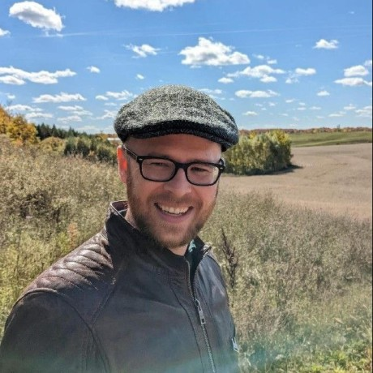

::: content-hidden
Share your career path and your experience and tools for data management and reproducibility

- Time is 1 hour, with 30 minute presentation and 20 minute Q&A
:::

# Outline

- Aim of talk

- Who I am and a brief history

- Experience doing data management and organization

- Reproducibility, challenges, and tools

- Why publications should not be the main focus

# Aim of talk

- *Most important*: Reminder that publications aren't your only or biggest metric of success

- Share a bit of my own career path

- Highlight gaps that you can specialise in for your own career

# Who am I? :wave: :wave:

::::: columns
::: {.column width="50%"}
[{style="border-radius: 50%"}](https://lukewjohnston.com/)
:::

::: {.column width="50%"}
- MSc and PhD in Nutritional Science
-   Team Leader, Steno Diabetes Center Aarhus and Aarhus University
-   Current work:
    -   Teach how to do open and reproducible science with R
    -   Build research software, mainly around data management
    -   Design ways to enable open and reproducible science
:::
:::::

## Academic path {.center}

```{mermaid}
gantt
    title My history
    dateFormat YYYY-MM-DD
    axisFormat %Y-%m
    MSc (UofT) :msc, 2011-09-01, 2y
    PhD (UofT) :phd, after msc, 4y
    Postdoc (UofT) :postdoc, after phd, 2018-02-01
    Postdoc (AU) :postdoc2, after postdoc, 2019-12-31
    Postdoc (SDCA) :postdoc3, after postdoc2, 2022-06-01
    Team leader (SDCA) :teamleader, after postdoc3, 2025-10-30
```

::: notes
I started out doing more "traditional" research but have gradually been
moving towards more computationally technical work, like software
development and data engineering as well as teaching researchers
better practices in coding, open science, and reproducibility

As I continued my research career, I got more and more into building
software and creating courses to teach researchers about better
programming practices. This also meant that I had less and less time to
publish papers, because, there's only so much time in a day.

As I go along, keep this in mind, because it highlights a big issue we
have in research.
:::

## MSc and PhD: Non-traditional work {.center}

In addition to my research...

. . .

- [PROMISE data](https://promise-cohort.gitlab.io/PROMISE): Organized data into an R package structure.

- Three R packages: [`mason`](https://cran.r-project.org/web/packages/mason/index.html), [`prodigenr`](https://cran.r-project.org/web/packages/prodigenr/index.html), [`carpenter`](https://cran.r-project.org/web/packages/carpenter/index.html).

- [UofTCoders](https://uoftcoders.github.io/): Graduate student-led group to teach R and Python to other peers.

::: notes
This isn't to brag, this is to highlight, that taking the time to learn
how to better make use of computers via programming can make you much more
effective at doing things more easily and faster.
:::

## Learning how to effectively organize files and code = powerful productivity {.center}

## During postdoc: Hard lessons learned {.center}

We are woefully behind on basic data engineering, reproducibility, and programming practices.

## Postdoc: Data organization, development, and management {.center}

-   [ukbAid](https://steno-aarhus.github.io/ukbAid/): R package and
    website for UK Biobank data management and analysis.

-   [DARTER Project](https://steno-aarhus.github.io/darter-project/):
    Website of application to and documentation on a Denmark Statistics
    project.

## Postdoc: Created and ran workshops (still do!) {.center}

-   Introductory course:
    [r-cubed-intro.rostools.org](https://r-cubed-intro.rostools.org/)

-   Intermediate course:
    [r-cubed-intermediate.rostools.org](https://r-cubed-intermediate.rostools.org/)

-   Advanced course:
    [r-cubed-advanced.rostools.org](https://r-cubed-advanced.rostools.org/)

## Problems arise in postdoc: Published very little papers {.center}

- After my PhD, very few first author publications.

- Too many deep problems that needed fixing.

- Focused on building software, tools, and teaching.

## Current work {.center}

- [Seedcase Project](https://seedcase-project.org)

# Research *must* learn to value more than just publications

Why? We have big problems that need fixing!

## Reproducibility is already a big issue {.center}

::: {layout-ncol="2"}
```{r}
#| echo: false
#| fig-height: 6
library(tidyverse)
theme_set(
  theme_minimal() +
    theme(
      plot.background = element_rect(fill = "#E9E9E9"),
      axis.title = element_blank(),
      axis.text.y = element_text(size = 18),
      axis.text.x = element_blank(),
      axis.ticks = element_blank(),
      axis.line = element_blank()
    )
)

search <- tribble(
  ~item, ~description, ~value, ~order,
  "Articles", "Found among all articles", 3467, 1,
  "GitHub\nrepos", "Those with a GitHub link and at least one notebook", 2660, 2
) |>
  mutate(
    item = fct_rev(fct_reorder(item, order))
  )

ggplot(search, aes(y = item, x = value, label = value)) +
  geom_col(fill = "#203C6E") +
  geom_text(nudge_x = 200, size = 5.5)
```

```{r}
#| echo: false
#| fig-height: 6
repro_results <- tribble(
  ~item, ~description, ~value, ~order,
  "Total notebooks", "Total notebook files found in all the repositories", 27271, 1,
  "Notebook repo\nwas valid", "File names were correct, dependency information was available, no local modules were needed.", 15817, 2,
  "Could install\ndependencies", "Could install dependencies without errors.", 10388, 3,
  "Finished executing\nwithout errors", "Could run without any errors.", 1203, 4,
  "Same results\nas paper", "When the results of the paper matched what the execution results output.", 879, 5
) |>
  mutate(
    percent = str_c(value, "\n(", round(value / max(value) * 100), "%)"),
    item = fct_rev(fct_reorder(item, order))
  )

ggplot(repro_results, aes(y = item, x = value, label = percent)) +
  geom_col(fill = "#203C6E") +
  geom_text(nudge_x = 1700, size = 5.5)
```
:::

[DOI:
10.1093/gigascience/giad113](https://academic.oup.com/gigascience/article/doi/10.1093/gigascience/giad113/7516267?login=false)

## Science is not about trust, it's about verification :thinking: {.center}

Some trust is needed, but shouldn't be dependent on it.

::: notes
The whole point of science is verification. Otherwise we are no
different from pseudoscience. If we can't verify that the results are
correct, by looking at the code and reviewing it and running it, how can
we know and trust it?
:::

## Desperately need more programming expertise! {.center}

## Analyzing large data (and reproducing the results) requires programming skills {.center}

-   With massive data, you really need to know how to code and
    programming.

-   But, researchers are not trained for this kind of skill.

::: notes
Hoping your skills and knowledge are enough to do the analysis, without
actually knowing if they are good enough.
:::

## "Science as amateur software development" {.center}

> "But the code runs!"

From this academic
[presentation](https://www.youtube.com/watch?v=8qzVV7eEiaI).

::: notes
The state of programming and software development in research is abysmal
to say the least.

The problem that researchers aren't even really aware of this problem No
funding goes to it, there are few courses on it, it isn't required, we
cannot hire skilled personnel for this either because it isn't funded
nor valued. What ends up happening? You get numbers from running the
analysis... But now do you even know it's right? Programming is *hard*,
way harder than doing research.
:::

## Desperately need research-specific software! {.center}

So many research-specific problems that could be fixed with software.

## Need more high-quality data {.center}

Data is hard to build, manage, and maintain. It takes time and effort.

# Sum up: Find problem(s) you enjoy fixing and dive deep! {.center}
