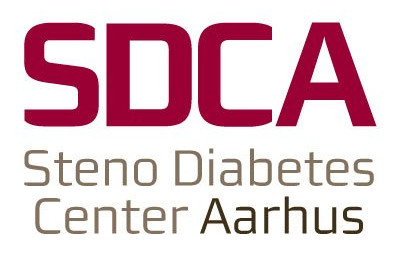

layout: true

<div class="my-footer">
<span>


<a href="https://slides.lwjohnst.com/steno/2020-11-26/">slides.lwjohnst.com/steno/2020-11-26</a>
</span>
</div> 

```{r setup, include=FALSE}
library(xaringanthemer)
options(htmltools.dir.version = FALSE)
knitr::opts_chunk$set(
  echo = FALSE,
  dev = "png",
  dpi = 150,
  comment = "#>",
  message = FALSE,
  warning = FALSE,
  fig.align = "center"
)

image_steno_path <- function(.file) {
    fs::path("..", "..", "steno", "2020-11-26", "images", .file)
}
```

```{r xaringan-themer, include=FALSE}
style_mono_accent(
    base_color = "#214c78",
    header_font_google = google_font("Monda"),
    text_font_google = google_font("Rosario"),
    header_h1_font_size = "54px",
    header_h2_font_size = "46px",
    text_font_size = "25px"
)
```

---

## What is this talk about?

--

.pull-left[
Title broken down:

- Tools and workflows
- Improving the process
- Scientific research
- Modern demands
]

--

.pull-right[
And re-arranged:

1. What does scientific research mean?
2. What are the modern demands?
3. What is the process that needs to be improved?
4. What are the tools and workflows?
]

???

In order to explain later parts of the presentation, I need to break down
the title and use that as the basis for the order I will talk about things.

---

class: middle, center

# What does scientific research mean?

---

## Philosophy of science and making a scientific claim

--

- Science has many philosophies
    - Focus will be on: *Verifying claims*

--

- How? By independently checking findings are:
    - *reproducible*
    - *replicable*

???

What does philosophy have to do with this? It's important to bring this up
because it is the basis to understand why the tools I'll talk about are 
important.

- Verification... *How* claim was made is more important than the claim itself. Anyone can make a claim, but a philosophy of science is that any
claim needs be to proven.

- Reproducible: Verify that exact process leading to findings can be produced
again and should be first step. (reproduce: literally to produce again)

- Replication: Verify that process can replicate  (of findings, without which
finding probably doesn't reflect reality) (replicate: to make a replica, make a
copy of)

---

## Replication vs reproducing

... terms are often confused with each other [1]

--

.pull-left[
### Replicability

- Independently get similar results when doing study again with same design and analysis plan
- Linked to the "irreproducibility crisis" [2]
]

--

.pull-right[
### Reproducibility

- Independently get same result when using the same data and code
- Should be easy right? Sadly, often just as hard
]

.footnote[
1. [Plessar, 2018](https://www.frontiersin.org/articles/10.3389/fninf.2017.00076/full#B9), also from an American Statistical Association [statement](https://www.amstat.org/asa/files/pdfs/POL-ReproducibleResearchRecommendations.pdf).  
2. Or rather "irreplicability crisis".
]

???

I'll get into research on reproducibility later.

---

```{r reproducibility-figure, fig.height=3.5}
library(scifigure)
library(tidyverse)
studies <- init_experiments(
    exp_names = c("Original", "Reproducing", "Replicating"),
    stage_names = c(
        "question",
        "experimental_design",
        "experimenter",
        "data",
        "analysis_plan",
        "analyst",
        "code",
        "estimate",
        "claim"
    )
) 
studies["analyst", "Reproducing"] <- "different"
studies[c("analyst", "experimenter", "data", "code"), "Replicating"] <- "different"

sci_figure(studies, 
    stage_names = c(
        "Question",
        "Exp. Design",
        "Experimenter",
        "Data",
        "Analysis Plan",
        "Analyst",
        "Code",
        "Estimate",
        "Claim"
    ),
    showlegend = FALSE
)
```


.footnote[[Patil, 2019](https://doi.org/10.1038/s41562-019-0629-z)]

---

## Requirements for verification [1]

Study design, methods, and analysis need:

- Detailed description

- Transparent and clear

- Easy to access to *any* researcher

- Record of activity 

- Inspectable and readable 

.footnote[
1. For both replicating and reproducing.
]

???

Description: This includes *how exactly* analysis was done, ie. based on
analysis code

Record: (for fraud identification, logs, trace-ability of what was done)

Inspectable: (linked to accessibility, but also common language, simple to read,
logical, well-reasoned)

---

class: middle, center

# What are the modern demands?

---

## Current state of verification in science

.pull-left[
- Already know *replication* is a major problem 
    - e.g. Many Labs Project, OSC Project, Reproducibility Project

- Don't know extent of *reproducibility*
    - Few studies share data [1]
    - Almost no study provides code [2]
]

--

.pull-right[
```{r reg-reports-figure, fig.width=4, fig.height=3}
tribble(
    ~text, ~value,
    "Data available", 41,
    "Code available", 37,
    "Could reproduce", 21
) %>% 
    mutate(text = fct_inorder(text)) %>% 
    ggplot(aes(x = text, y = value, label = value)) +
    geom_col(fill = "#214c78", width = 0.7) +
    geom_text(nudge_y = 3) +
    annotate("text", y = 64, x = 2.75, label = "Total articles: 62") +
    coord_cartesian(ylim = c(0, 65)) +
    theme_minimal() +
    labs(y = "Articles",
         title = "Reproducibility of Registered\nReports in Psychology [3]") +
    theme(axis.title.x = element_blank(), 
          panel.grid = element_blank())
```

]

.footnote[
1. [Wallach, 2018](https://pubmed.ncbi.nlm.nih.gov/30457984/)
2. [Leek, 2017](https://www.annualreviews.org/doi/10.1146/annurev-statistics-060116-054104),
[Considine, 2017](https://link.springer.com/article/10.1007/s11306-017-1299-3)
3. [Obels, 2020](https://doi.org/10.1177/2515245920918872)
]

???

OSC project: Open Science Collaboration Project

Except maybe bioinformatics, where about 60% of studies do.

There are lots of reasons for this, likely due to:

- Lack of awareness and training
- Difficulty of adoption
- No incentive or reward
- Little to no culture to do it

---

## ... Leading to present modern demands

.middle[
**Research studies need to be more reproducible and replicable [1]**

**Research output needs to include more than just the manuscript (e.g. data, code) [1]**
]

.footnote[
1. Selected articles: [Goldacre, 2019](https://doi.org/10.1136/bmj.l6365); [Munafó, 2017](https://www.nature.com/articles/s41562-016-0021); [TOP guidelines](https://science.sciencemag.org/content/348/6242/1422.full);
[Transparency Checklist](https://www.nature.com/articles/s41562-019-0772-6)
]

---

class: middle, center

# What is the process that needs to be improved? 

## And what are the tools and workflows for it?

???

There are several efforts at addressing the replicability problem,
but currently there isn't much focus on the reproducibility problem.

---

## *Reproducibility*: Moving toward it

.center[
```{r, out.height="85%", out.width="85%"}
knitr::include_graphics(image_steno_path("reproducibility-spectrum.jpg"))
```
]

.footnote[[Peng, 2011](https://science.sciencemag.org/content/334/6060/1226).]

--

- **First steps: Using *Version Control***

???

As I mentioned earlier, reproducibility is about taking the same data and the 
same analysis plan with the code and having someone else reproduce the
exact same findings as the original authors.

There are various degrees of this and we in health research have challenges 
with the data side of the issue, but sharing the 

Not same as keeping backups like when e.g. using Dropbox

---

```{r basic-vs, echo=FALSE, fig.cap="Most common form of 'version control' is through naming files, but is very manual and error-prone.", out.width="85%"}
knitr::include_graphics(image_steno_path("informal-version-control.jpg"))
```

???

An extremely common and very manual form of version control that many of you may
recognize is by naming your files differently depending on the date of edits
or version that was sent around to e.g. co-authors.

However, this is a highly informal system and very prone to error and mistakes.

---

## Formal version control software: Git

Think about these questions: 

- Do you have many files of different versions of a manuscript do you have, including getting feedback from co-authors, etc?

- Have you ever wanted to write out and test some ideas in your code or
manuscript and need to make a new file so that the original is not modified?

- Have you ever deleted text in a manuscript or code and wish you hadn't?

--

=> Answered yes to any? Git helps by managing changes to files for you.

---

## Git and reproducibility

.pull-left[
Version control like Git fulfills:

- Transparency

- Record-keeping

- Self-containment

- Accessibility

]

--

.pull-right[
And *key* aspect:

- It forms base for other components of reproducibility
]

???

- Transparency of work done to demonstrate or substantiate your scientific claim.
- Claim to first discovery, since you have a time-stamped history of your work.

Self contained in that all files related to a scientific claim are kept together
and discoverable together.

Accessible: many ways to find and share research project

There are numerous other tools that improve or contribute to reproducibility that
work through version control software like Git. Without it, these other tools
don't work or are quite difficult.

---

## Numerous benefits other than reproducibility

- Better collaboration <!-- Both internal and external -->

- Better project management

- Greater visibility 

- Greater potential for gaining collaborators

- Defend against fraud

- Evidence of contributions and work


???

- Collaboration because of single location and single file/folders to work on.
- Organized files and folders, since there is one single project folder and one
single version of each file, rather than multiple versions of the same file.
- Less time finding things, because everything is organized and in one place.

<!-- (e.g. this is why plain text file formats are preferred, because they fit a philosophical component of science). -->

---

## Real-world examples: My own projects

- (Largely) solo project: [NetCoupler](https://github.com/NetCoupler/NetCoupler)

- Team-based and national/local project: [r-cubed](https://gitlab.com/rostools/r-cubed) 

- Global collaboration project: [py-rse](https://github.com/merely-useful/py-rse) 
