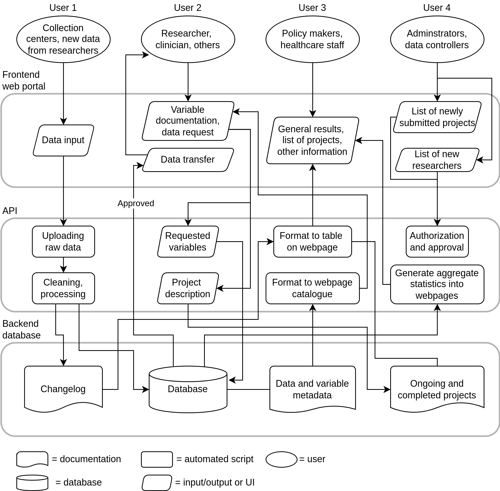

---
# For Niels to BI team.
title: "A framework for an open and scalable infrastructure for health data exemplified by the DD2 initiative"
output:
  xaringan::moon_reader:
    lib_dir: libs
    css: "xaringan-themer.css"
    nature:
      slideNumberFormat: ""
      ratio: "16:9"
      countIncrementalSlides: false
---

layout: true


```{r setup, include=FALSE}
options(htmltools.dir.version = FALSE)
knitr::opts_chunk$set(
  echo = FALSE,
  message = FALSE,
  warning = FALSE,
  fig.align = "center"
)
```

```{r print-pdf, eval=FALSE}
# To print to PDF
# Doesn't work yet, need to figure out how to include the logo...
# pagedown::chrome_print(here::here("steno/2022-04-26/mini-talk.html"))
```

```{css}
.footer-right {
    background-color: #FFFFFF;
    position: absolute;
    bottom: 10px;
    right: 8px;
    height: 60px;
    width: 30%;
    font-size: 11pt;
}
```

```{r xaringan-themer, include=FALSE}
library(xaringanthemer)
style_mono_accent(
    base_color = "#990033",
    base_font_size = "22px",
    text_font_size = "1.3rem", 
    text_font_google = google_font("Nanum Gothic"),
    header_font_google = google_font("Merriweather Sans", "300")
)
```

.footer-right[
Website: [steno-aarhus.github.io/dif-project](https://steno-aarhus.github.io/dif-project)  
]

---

```{r progress-bar}
xaringanExtra::use_progress_bar(color = "#990033", location = "top")
```

```{r logo-sdca}
xaringanExtra::use_logo(
  image_url = "../../common/sdca-logo.png",
  link_url = "https://www.stenoaarhus.dk/",
  width = "60",
)
```

## Data Infrastructure Framework (DIF) Project

1. **Primary aim**: Create and implement an efficient, scalable, and open source
data infrastructure framework that connects data collectors, researchers,
clinicians, and other stakeholders, with the data, documentation, and findings
(starting within the DD2 study)

2. **Secondary aim**: Create this framework so that *other research groups and
companies*, who are unable or can't build something similar, can relatively
easily implement it and modify as needed for their own purposes.

> In short: Make a software product that makes it easier to find, store, and
use data for research projects that abide by best practices, and make it so
that it is easy and free to use for others.

---

## Target users

1. Anyone, such as new researchers/PIs, small-to-medium sized enterprises,
collecting or working with data for scientific purposes and who want/need to
adhere to best practices but who don't have the technical skills or knowledge
necessary.

2. Anyone, such as PhD students or new postdocs, who want to discover and learn
about what data and variables are available that they can or will use.

3. Anyone, like administrators of multi-center projects, who need to 
track changes and additions to data as well as who is using which variables for
what.

---

## Aim to help answer questions like:

- How and where do store your data and in what file format?

- How do you keep track of changes to the data and which versions researchers are using? Necessary if, for instance, data is audited

- How do you, your collaborators, or trainees find out what variables there are
in the data and what do they mean?

- *When* errors or problems happen in your data, and *if* you've already
published with or analyzed on it, how do you determine which publications used
the incorrect data? 

- How can you easily share your data with colleagues or reviewers to check your
findings?

---

## Guiding principles underlying DIF Project

1. Follow and enable FAIR principles

2. Openly licensed and re-usable (e.g. CC-BY, MIT) 

3. State-of-the-art principles and tools in software and UI design

4. Friendly to beginner and non-technical users

---

```{r fig-detailed-schematic, out.width="58%"}

```

---

## Short-term plan

> [Full 5 year timeline found on website.](https://steno-aarhus.github.io/dif-project/#deliverables-and-milestones)

- Hire software/data engineers and build team as soon as possible

- Developing "Minimum Viable Product" of first component within ~2 years

- Emphasize making training and documentation targeted to non-technical users throughout project

