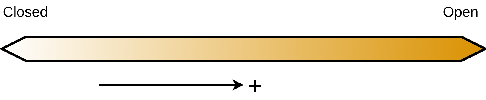

---
# For Data Management in Research, a PhD seminar at SDCA
title: "Open science and FAIR principles: Under-valued and under-appreciated"
author: "Luke Johnston"
output:
  xaringan::moon_reader:
    lib_dir: libs
    css: "xaringan-themer.css"
    nature:
      slideNumberFormat: ""
      ratio: "16:9"
      countIncrementalSlides: false
---

layout: true

```{r setup, include=FALSE}
options(htmltools.dir.version = FALSE)
knitr::opts_chunk$set(
  echo = FALSE,
  message = FALSE,
  warning = FALSE,
  fig.align = "center"
)
library(emoji)

fa2 <- function(icon, fill = "#da9100") {
    fontawesome::fa(name = icon, fill = fill)
}
```

```{css}
.footer-right {
    background-color: #FFFFFF;
    position: absolute;
    bottom: 10px;
    right: 8px;
    height: 60px;
    width: 30%;
    font-size: 11pt;
}
```

```{r xaringan-themer, include=FALSE}
library(xaringanthemer)
style_mono_accent(
    base_color = "#990033",
    base_font_size = "21px",
    text_font_size = "1.2rem",
    text_font_google = google_font("Nanum Gothic"),
    header_font_google = google_font("Merriweather Sans", "300")
)
```

<!-- TODO: convert this to functions? -->

.footer-right[
Slides: [slides.lwjohnst.com/steno/2022-10-25](https://slides.lwjohnst.com/steno/2022-10-25/)
Licensed under CC-BY `r fa2("creative-commons-by", "#990033")`
]

---

```{r progress-bar}
xaringanExtra::use_progress_bar(color = "#990033", location = "top")
```

```{r logo-sdca}
xaringanExtra::use_logo(
  image_url = "../../common/sdca-logo.png",
  link_url = "https://www.stenoaarhus.dk/",
  width = "60",
)
```

<!--
Details:

- Data are the fulcrum of research. Still, within this field, good practices and
law are tricky to navigate.
- Total: 1-1.5 hrs. Aim for 1.25 (for a break)
    - 75 min with discussions and lecture

-->

# Learning objectives

1. Accept that if you do any data management, you *will* struggle *a lot* and that's normal

2. Explain the definition of open and what it ultimately means for research

3. Describe at least some of the components of open science

4. Explain what FAIR is and its importance to research

5. Understand why *creating* open and FAIR data is **hard**... and why *managing*
non-open and non-FAIR data is **harder**

6. Know about some practical ways to making data FAIRer and open

.footnote[Slides are more text heavy, to use as reference later.]

???

Not going to read these in detail, briefly summarize

---

class: middle

# What is open science?

## Show of hands, who could explain it?

.footnote[Aka: open research or open scholarship]
???

I'll be explaining it anyway.

---

class: middle

## Brief history on open science: Initially about *open access* to papers

???

Who could explain open access?

Depending on how you define open, could be accessible to more people. If that's
the case, "open" science started when journals came into existence, because
before that scientists were very secretive about sharing results.

--

> "Open": Usually defined by the copyright license assigned to it (e.g. [Creative Commons](https://creativecommons.org/)).

.footnote[Definition from [Open Knowledge Foundation](https://opendefinition.org/licenses/) and [Open Source Initiative](https://opensource.org/licenses).]

???

But let's go with the more modern definition of open.

License example are these slides (point to footer).

---

## But there are many components to open science... though most are neglected

<center>
```{r fig-open-science-components}
library(DiagrammeR)
open_science_diagram <- grViz("
graph neato {

graph [layout = neato, sep = '0.15', overlap = false]

node [fillcolor = none, shape = oval]
science [label = 'Open\nScience']

node [shape = box, style = 'rounded, filled']
node [fillcolor = grey40]
materials [label = 'Open\nMaterials/Methods']
infra [label = 'Open\nInfrastructure']

node [fillcolor = green4]
access [label = 'Open\nAccess']

node [fillcolor = green3]
data [label = 'Open\nData']

node [fillcolor = darkorange2]
repro [label = 'Open Code\n(Reproducibility)']
source [label = 'Open\nSource']

science -- {source materials infra repro access data}
}")
widgetframe::frameableWidget(open_science_diagram)
```
</center>

???

Focus on what gets excluded, e.g. open source, code, open metadata
standards, open infrastructure, etc

Can anyone tell me the difference between Open Code and Open Source?

Has anyone ever heard of Open Materials/Methods or Open Infrastructure?

- Reagents or lab protocols.

---

## Open science isn't completely binary: It's a spectrum

```{r fig-spectrum-open-science, out.width="80%"}

```

.pull-left[
\+ Open access (like preprints)
\+ Open protocol
\+ **Open data/data format**
]

.pull-right[
\+ Open analysis plan/code
\+ Open source (like software used)
]

???

Even within each of these components, "openness" can be a spectrum.

--

> A bit open is better than nothing open.

???

I'll get into why this is important for data, but not for science in general.

---

class: middle

# What is open data?

> Most basic level: Is publicly accessible with an open license.

.footnote[Can be open and follow law, not mutually exclusive, just trickier.]

???

Want to note about the previous talk, you can have both openness and still follow
the law on privacy and security. Takes a bit more work but its definitely
possible in many cases (not all, e.g. DST).

---

## Discussion time (~6 min) `r emoji("comment")`

> Is data with a closed license less useful? `r emoji("thinking")` ... it's complicated ... `r emoji("confused")`
>
> 1. Why is it complicated?
> 2. How can "closed" data still be useful?

1. Think on your own for ~1 min .

2. Discuss with your neighbour for ~4 minutes.

3. Share all together for ~1 min.

---

## Data can be closed, but still "more easily accessible" and be useful to science

**Example**: UK Biobank as an "open access" data resource (really called "gated-access")

--

**Part of UK Biobank's License**

> "UK Biobank hereby grants to the Applicant a revocable, worldwide,
royalty-free, non-exclusive, non-transferable licence (but not any ownership
rights) during the Term to use the Materials for the Permitted Purpose, subject
to the terms and conditions of this Agreement."

---

class: middle

## Discussion time with everyone (~6 min) `r emoji("comment")`

> ... but it is even more complicated than that... `r emoji("grimace")`. Why
doesn't making a dataset accessible (with or without a closed license) make it
*useful or even usable*?

???

For instance, UK Biobank is useful, usable, mostly-accessible, but not open.

---

## More to openness than an open license or "open access"

> ... it needs to be FAIR too!

1. Findable

2. Accessible

3. Interoperable

4. Reusable

???

Emphasize that while open data is a thing, the practicalities of it, e.g. the
"physical" infrastructure of it, isn't always so open or well defined

---

## Interoperable and Reusable: Can it be *easily* integrated with other tools or re-used?

???

Let's focus on the I and R of FAIR.

--

**Answer these questions**:

- If the software to import, export, or load the data is closed (e.g. Stata, SAS)... Yes or no?

???

Keyword: easily.

--

- If file format is closed or proprietary (e.g. Excel, SAS)... Yes or no?

???

For instance, why did Excel change their file ending from xls to xlsx?

Usually open software to load closed formats needs to be back engineered,
since companies don't share how they encoded things. E.g. LibreOffice for docx

--

- If metadata isn't included... Yes or no?

--

- If the variables in the dataset aren't in a standard location... Yes or no?

???

For instance, some are on the first line, others are not.

--

- If a numeric value is used to indicate missingness (e.g. 99)... Yes or no?

---

class: middle

## ... making things FAIR is *hard*! `r emoji("peep")`

.footnote[
- Even harder when researchers don't understand nor value skill needed for it.
- There's whole, highly-technical careers dedicated to data/software.
]

???

A lot of considerations need to go into making a dataset usable and open.

---

class: middle

# We didn't really need to do worry about this before, why now?

???

A few decades ago this wasn't really an issue at all, or at least not that big
of an issue.

---

class: middle

## Discussion time (~6 min) `r emoji("comment")`

> - Why are these things important? And why now?
>
> - What are some challenges you've faced with data and how it is structured?

1. Think on your own for ~1 min.

2. Discuss with your neighbour for ~4 minutes.

3. Share all together for ~1 min.

???

Time a minute to think about it before sharing.

---

## Many reasons why it is important `r emo::ji("face_with_monocle")`

- Tightly tied to reproducibility

    - How to verify claim if data can't easily be shared?

--

- Increase impact and visibility of your work and more re-use

--

- Collection and volume are getting larger and more complex

    - Very cost-efficient to fund larger studies that share widely

--

- Cross-country and institute collaboration continues to increase

    - Need easier ways to collaborate effectively

???

Especially those of the older generation, data was different. We have SO much
of it now. The skills needed are way more complicated and difficult.

---

## More time spent considering these things = less time spent later on

**More effort and more time spent for both users and data owners if...**

--

.pull-left[
- More restrictions (example: closed copyright, gated-access)
    - Need lawyers for license
    - Need enforcement systems
    - Need gated access control systems
    - Need personnel to manage systems and deal with issues
]

--

.pull-left[
- Not well documented and not FAIR
    - Need personnel (likely grad students/postdocs) to deal with basic issues
    - Need in-person training/onboarding to work with data
    - Need software license to access/use data
]


---

## Example related to licensing

> [UK Biobank Data Showcase](https://biobank.ndph.ox.ac.uk/showcase/index.cgi):
"Legal notice: Without a written licence, you may not copy, reproduce,
republish, download, distribute, make available to the public or otherwise use
any of the content displayed on this website in whole or in part or permit or
assist any third party to do the same, except to the extent permitted at law."

???

Can't make an R package to help organize or display this information.

Need lawyers if someone violates copyright.

Need system to report violations.

Need people to check if it is a violation.

A simple switch from this license to a CC-BY means that you don't
have those issues any more.

---

class: middle

## So many benefits... Why isn't this normal then?

.footnote[One reason: Not valuing software and data engineering in research environments.]

???

- Mention data engineering here.

---

class: middle

# Um, how is data and software engineering relevant?

--

.footnote[Make computers do more work, so we humans can be creative and think.]

???

Initially more of IT or software engineering work

---

## Globals trends show rise in interest, mainly in industry

```{r fig-google-trends, fig.width=7, fig.height=3, dpi=300, out.width="80%"}
library(tidyverse)
library(lubridate)
library(geomtextpath)

read_csv(
    here::here("steno/2022-10-25/data/google-trends.csv"),
    skip = 3,
    col_types = "cccc",
    col_names = c(
        "year_month",
        "data_engineering",
        "data_science",
        "software_engineering"
    )
) %>%
    pivot_longer(cols = -year_month) %>%
    mutate(value = as.numeric(str_remove(value, "<")),
           date = lubridate::as_date(str_c(year_month, "-01")),
           name = str_replace_all(name, "_", " ")) %>%
    ggplot(aes(x = date, y = value, colour = name, label = name)) +
    geom_line(size = 1) +
    scale_color_brewer(palette = "Dark2") +
    theme_minimal() +
    ylab("Relative interest in Google searches") +
    theme(axis.title.x = element_blank(),
          legend.title = element_blank(),
          legend.position = c(0.2, 0.8))
```

.footnote[Source: [Google Trends](https://trends.google.com/trends/explore?date=2012-01-01%202022-10-13&q=%22data%20engineering%22,%22data%20science%22,%22software%20engineering%22)]

---

## Data engineering is still is a very new area

--

- Industry > academia

???

Industry tends to be better at it than academia.

--

- Some companies (`r fa2("google")` `r fa2("facebook")` `r fa2("amazon")`) > others

    - Many have manual/non-standardized processes, with data in e.g. Excel

???

Surprising number of cases where someone is hired as a data scientist or data
engineer and their entire job is spent fixing issues with the process being in
Excel and having to do manual stuff. Stuff that was not described in the job
ad.

--

- Some research institutes (e.g. UK Biobank) > others

    - Overall, research is far behind best practices

--

- Some fields (physics, ecology) > biomedical/health research

    - Likely because of funding, privacy, and IP issues

---

## How does engineering relate to open and FAIR?

By making use of some of their principles! `r emoji("star-struck")`

--

.pull-left[
- Composable

- Modular
]

.pull-right[
- Single-purpose

- Interoperable
    - (across ALL components of science)
]

.footnote[Think of Lego!]

--

> All together `r emoji("right_arrow")` build ecosystems

---

class: middle

## Discussion time (~6 min) `r emoji("comment")`

> How do **you** think data and software engineering can help?

1. Think on your own for ~1 min.

2. Discuss with your neighbour for ~4 minutes.

3. Share all together for ~1 min.

???

So I want to hear what you think might help you out? Whether you know a bit or
nothing about engineering, what can you

Might be making theoretical sense, but how? Practically?

---

## Data engineering can make data FAIRer `r emoji("star_struck")`. How exactly?

--

- Building APIs to connect with other ecosystems (A, I, R)

--

- Automatic implementing and checking of standards for metadata, file formats (CSV, JSON), and file/folder organization (F, A, I, R)

--

- Using modern and efficient database (open) software like Postgres, DuckDB, Parquet (A, I, R)

???

Example: I converted the DST SAS file formats into Parquet storage
and can load them into DuckDB... for MUCH faster analysis.

--

- Automatic versioning and publishing of data (F, A, R)


???

We have versions for software, for papers/manuscripts. Why not data?

--

- Using Git and GitHub to collaboratively build (and share) the infrastructure to manage data (F, I, R)

---

class: middle

## Example: We have a (recent NNF-funded) project on an open infrastructure for data:

### Data Infrastructure Framework (DIF) Project (title WIP)

.footnote[
- Website: https://steno-aarhus.github.io/dif-project/
- [](https://doi.org/10.5281/zenodo.6511112)
]

???

Not going to go into any detail here, just a description.

---

class: middle

# How can I make my data more open and FAIR?

## Question: How many work with human data?

???

Before continuing, I want to know how many here work with human data?

As we learned in the previous section, human data has special considerations.
If you don't work with personal data, you have it easy!


---

## Simple first steps to making data FAIRer:

1. Advocate for making data open and FAIR (push for funding, hiring, learning)

???

This is the biggest thing you can do to make it FAIRer. This is especially
important if you personally don't own or have control over what happens to the
data.

--

2. Save as CSV (or other open file format)

???

This is the second biggest thing you can do to make it FAIRer. Any type of data, either
raw data or your results as a data file, save as a CSV.

--

3. Use consistent and descriptive variable names, example:

    ``` text
    glucose_0min, glucose_30min, family_history_t2dm, gender, birth_year
    ```

--

4. Include a metadata file (example name `metadata.csv`) with the data, example:

    ``` text
    variable, description
    glucose_0min, Fasting glucose measured before the glucose challenge.
    glucose_30min, Glucose measured 30 minutes after glucose challenge.
    weight, Weight measured on a standard scale, in underclothes.
    height, Height measured without shoes.
    ```

---

## Practical ways of licensing and sharing data

.pull-left[
[Licenses](https://opendefinition.org/licenses/) (if you have ownership), as
easy as having license text in a file (`LICENSE.md`) with the data:

- [CC-BY](https://opendefinition.org/licenses/cc-by/)
- [ODC-By](https://opendatacommons.org/licenses/by/)
]

--

.pull-right[
Sharing can also be easy! (depends on size of data though)

- [Zenodo](https://zenodo.org/)
- [OSF](https://osf.io/)
- [Dryad](https://datadryad.org/stash)
- Domain-specific repositories (there are many)
]

---

class: middle

## Discussion time (~6 min) `r emoji("comment")`

> How might you be able to make *your* data more open and FAIR? What are some challenges you foresee?

1. Think on your own for ~1 min.

2. Discuss with your neighbour for ~4 minutes.

3. Share all together for ~1 min.

---

# Key messages linked to learning objectives

--

1. If you're struggling with data... that is totally normally!!

--

2. Open = license used (CC-BY). Easier collaboration, re-use, and management.

--

3. Open science has many components, like open data and open source.

--

4. FAIR: Findable, Accessible, Interoperable, Re-usable. Includes file format,
software used, metadata. Makes your own work easier.

--

5. Creating open, FAIR data needs skill and knowledge. Saves times during management and analysis.

--

6. Advocacy is first step to making data FAIR and open. Second step, use CSV/open formats

<!--

## Principles-in-action: Inexpensive and automated journal submission and processing with open APIs and infrastructures

[Journal of Open Source Software (JOSS)]()

- Git, GitHub, and GitHub Actions, e.g. Open Journals
- List cost and blog

workflow

1. Write paper on your GitHub
2. Submit to JOSS GitHub Issue -> JOSS ext

    - DE: Our DIF project

## Real world examples of these principles in action in improving openness

## Principles-in-action: Better scholarly writing with R Markdown and Quarto

## Easy R package creation with Git, GitHub, and devtools

https://raw.githubusercontent.com/rstudio/cheatsheets/main/package-development.pdf

Because of this, lead to a set of standards and conventions for making packages,
which has lead to R packages being better at working together and creating a
more cohesive ecosystem. For instance, standard files for licensing, easy and quick
connection to Git and GitHub, automated checks of your package, and so on.

- Git and GitHub
    - Emphasis making websites, openness and accessibility right from the start

- devtools and usethis R packages

class: middle

# But, what about data engineering examples? `r emoji("thinking")`

.footnote[Good example is [Ocean Health Index](http://ohi-science.org/data-science-training/) (DOI: [10.1038/s41559-017-0160](https://doi.org/10.1038/s41559-017-0160)).]

-->
